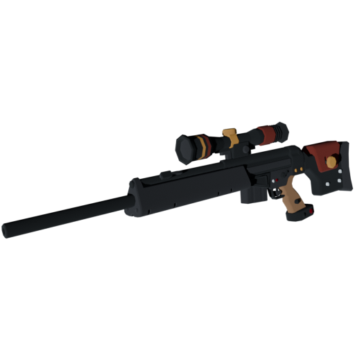

# harunaMachina
A mod replacing the Machina with Haruna's gun Ideal from Blue Archive

My first weapon mod replacing a model, will do more because it's kind of fun.

Main credits goes to AlexEatDonuts for fixing issues with textures and giving team-colored Machina
https://gamebanana.com/members/1437067

Casual compatible, advised to use Cukei's Preloader
https://gamebanana.com/tools/19049

Kudos to this single goated tutorial bringing me through
https://www.youtube.com/watch?v=ZY3RBHZ-dGM

However it is a pain in the ass for me to make mods on Linux, especially how shitty Valve made studiomdl
so credits to the Linux build of the studiomdl MDLForge as well
https://github.com/programmer1o1/MDLForge

Credits to the original guy who got the original Blue Archive model
https://sketchfab.com/3d-models/blue-archive-weapon-kurodate-haruna-fce3850f0e264b32b74caa083f40f954

And lastly credits to the guy making Crowbar, VTFedit, and GCFScape, and also the guy redistributing it as AUR
https://aur.archlinux.org/account/defusq
